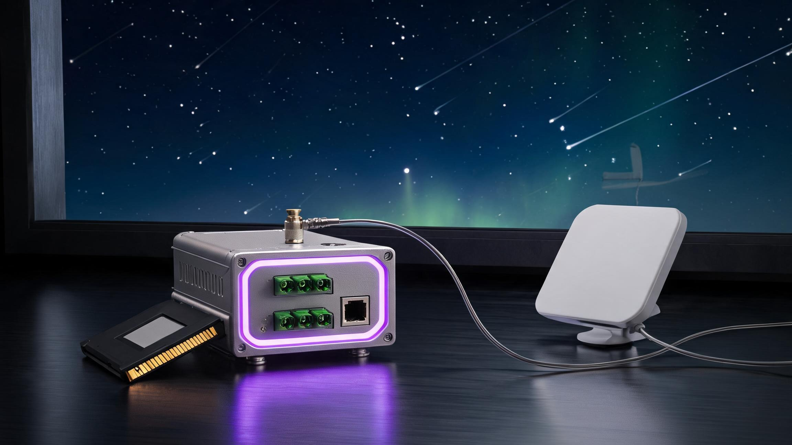

# Grok Deck

**Grok thinks. Here's its body.**

An open-source hardware companion for AI agents — an industrial + wireless gateway that lets Grok **touch real machines**: Modbus (RTU/TCP), CAN/J1939, OBD-II, BLE 5.2, LoRa. On-device NPU sandbox, xAI cloud supercompute through a **physical Approve gate**, Starlink satellite backhaul off-grid, and prepaid compute credit in an **encrypted cold-wallet cartridge**.

**Compute in space. Data in the card.**

**Independent community project.** Not affiliated with, endorsed by, or connected to xAI, SpaceX or Starlink. "Grok" is an xAI trademark, used here to indicate protocol compatibility only.

---

## The invariant

Three compute layers answer one question — *where the compute happens*. They never change where the boundary lives:

| Rule | Meaning |
|---|---|
| **gate** | The mandatory authorization gate is the only path to any cloud model. No bypass, no direct API, no debug backdoor. |
| **write** | Any agent device-write passes the physical Approve button. However large the cloud compute. |
| **return** | Cloud responses are signed and land back on the local encrypted cartridge. Nothing is retained in the cloud. |
| **wallet** | Compute credit is deducted offline inside the cartridge's secure element. The cloud never sees the balance or the identity. |
| **never** | Raw data, personal baselines, key material — never leave the cartridge, on any layer. |

## Three compute layers

1. **On-device NPU sandbox** — a sub-4B model plus anomaly detection, resident on the gateway. Baselines, weather math, risk briefs never offloaded. Pull the network: everything still works (EVT hard gate).
2. **xAI supercompute, gated** — large-model inference through the gate: consent card present → declared fields cover the request → Approve pressed. Requests carry aggregated features only; responses land signed on the cartridge. Endpoint unreachable → degrade silently to Layer 1.
3. **Starlink backhaul** — rangeland, pump stations, valleys: LoRa near-field aggregation, satellite uplink. We integrate nothing, resell nothing — users bring their own terminal. The layer is detachable by design.

## Compute-credit cold wallet

The same floppy-form encrypted cartridge stores both data and prepaid compute credit — priced per token, denominated at a USDT-pegged rate:

- **Offline balance** — in the secure element, follows the card across devices
- **Atomic deduction** — double-spend impossible, every decrement paired with an audit record
- **Gift cards** — refill by one-time signed voucher confirmed at the Approve button
- **Compliance posture** — the card stores a credit number only: no token issued, nothing on-chain, no yield, no appreciation. A prepaid meter, not a wealth-management product.

## One body, any brain

Five form factors, one protocol stack — desk console, DIN-rail industrial, socket, home hub, screenless guardian pendant. Any MHS-compatible agent (Grok, OpenWorker, your private model) binds through the same registry and faces the same button. **Swapping an agent is a software action; swapping a body is a retooling.**

## EVT acceptance

| # | Check | Pass condition |
|---|---|---|
| V1 | Offline night-shift loop | 8 h unplugged: full function |
| V2 | Signed call chain | Every cloud call resolves to a five-field audit tuple |
| V3 | No-consent refusal | Card pulled → all cloud calls fail, no bypass |
| V4 | Double-spend | Concurrent deductions → balance decrements once |
| V5 | Balance migration | Card moves device → balance and audit intact |
| V6 | Brain swap | Reflash agent image → binding succeeds, hardware untouched |
| V7 | API degradation | Endpoint down → local mode, task continues |

## Links

- Landing page — <https://hdhaidong.github.io/grok-deck/>
- Architecture note — [any-agent-architecture.md](https://github.com/Hdhaidong/openworker-deck/blob/main/docs/any-agent-architecture.md)
- Parent project — [OpenWorker Deck](https://github.com/Hdhaidong/openworker-deck)
- Hardware-binding spec PR — [andrewyng/openworker#596](https://github.com/andrewyng/openworker/pull/596)

Design freeze (now) → EVT (~10 weeks) → DVT (~8 weeks) → PVT & certification (~6 weeks) → production (~8 weeks). Concept renders, EVT-stage specifications; certification figures locked at DVT.
